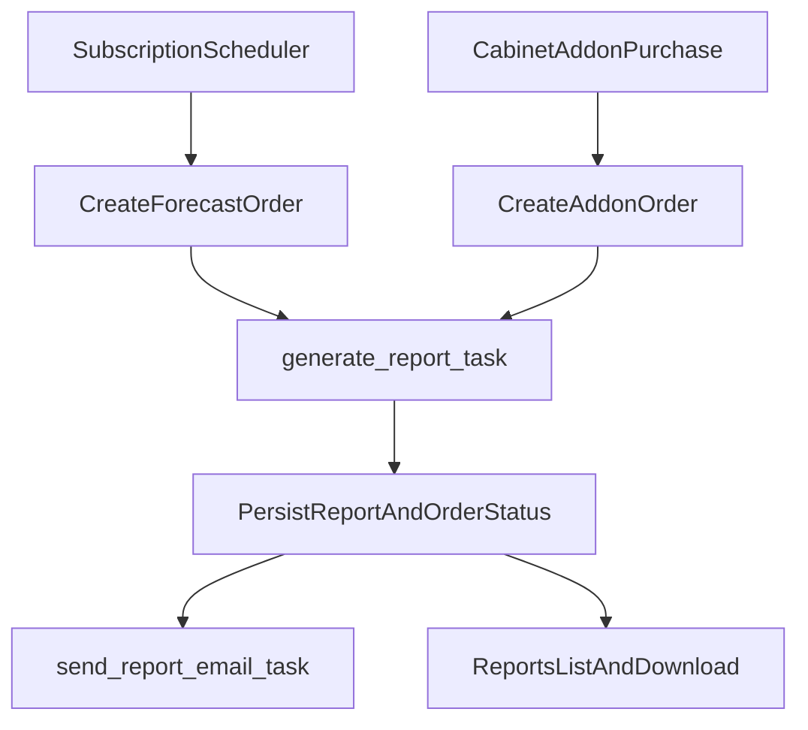
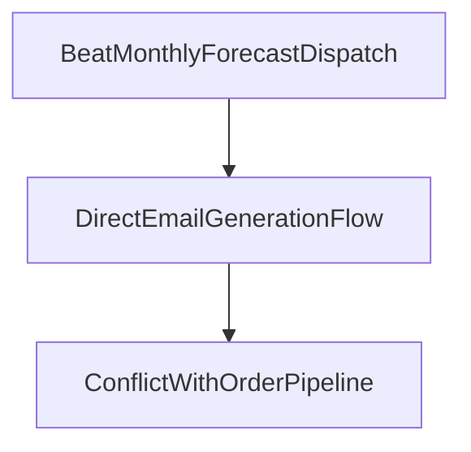

# План реализации транзитов и прогрессий без дублирования pipeline

## 1) Цель документа

Зафиксировать целевую реализацию транзитов/прогрессий с одним техническим pipeline и разными правилами доступа:
- подписки (`sub_monthly`, `sub_annual`) получают прогноз автоматически каждый месяц;
- разовые покупатели (`report`, `bundle`) могут докупить единоразовый прогноз только в личном кабинете через add-on;
- wizard не изменяется.

Документ описывает продуктовый контракт, архитектуру, этапы внедрения, тесты и критерии готовности.

---

## 2) Продуктовые решения (финальные)

1. **Wizard не трогаем**.
   - В wizard остаются только существующие `report_options` для доп. секций натального отчета.
   - Тумблеры транзитов/forecast в wizard не добавляются.

2. **Докупка транзитов для разовых пользователей — только в личном кабинете**.
   - Для `report`/`bundle` add-on доступен только после покупки базового отчета.
   - Покупка add-on создает отдельный one-time `Order`.
   - Add-on дает один forecast-отчет на одно окно (не ежемесячный цикл).

3. **Для подписок forecast включен по умолчанию**.
   - `sub_monthly` и `sub_annual` имеют одинаковую forecast-функциональность.
   - Разница только в биллинге и экономике тарифа.
   - Формирование monthly forecast идет автоматически scheduler-ом.

4. **Единый technical pipeline для генерации и доставки**.
   - Любой forecast-отчет (подписка или add-on) проходит через:
   - `Order -> report_generation -> Report -> report_notifications -> личный кабинет / email`.

---

## 3) Матрица доступа

### Подписки
- `sub_monthly`: forecast включен по умолчанию, ежемесячная генерация.
- `sub_annual`: forecast включен по умолчанию, тот же cadence.

### Разовые тарифы
- `report`, `bundle`: forecast не включен в базовый продукт.
- Получают доступ только через add-on в личном кабинете:
  - `transit_month_pack` (транзиты без прогрессий),
  - `forecast_month_pack` (транзиты + прогрессии).

### Правило источника постановки заказа
- Подписка: заказ создается scheduler-ом.
- Разовый add-on: заказ создается через `/addons/{addon_slug}/purchase`.

---

## 4) Целевая архитектура

### 4.1 Единый путь (to-be)

### 4.2 Что исключаем

Direct monthly flow не должен быть production-источником генерации, иначе возникает второй источник истины.

---

## 5) Технический контракт данных

Для forecast-отчетов (и подписочных, и add-on) в `Order/Report` должен быть единый контракт:

- `order.forecast_window_start`
- `order.forecast_window_end`
- `report.report_type = "forecast"`
- контент определяется `tariff.features`:
  - `includes_transits: true|false`
  - `includes_progressions: true|false`
  - `forecast_window_days: int` (по умолчанию 30)

Рекомендуемый mapping:
- `transit_month_pack`: `includes_transits=true`, `includes_progressions=false`
- `forecast_month_pack`: `includes_transits=true`, `includes_progressions=true`
- `sub_monthly/sub_annual`: обе опции `true`

---

## 6) Поведение по сценариям

### 6.1 Подписка (автоматически)
1. Beat вызывает scheduler.
2. Scheduler проверяет due-подписки и антидубли.
3. Создает `Order` с forecast-окном.
4. Ставит `generate_report_task`.
5. После завершения:
   - отчет доступен в личном кабинете;
   - отправляется email со ссылкой на скачивание.

### 6.2 Разовый пользователь (докупка в ЛК)
1. В личном кабинете пользователь видит eligible add-on.
2. `POST /addons/{addon_slug}/purchase` создает add-on `Order` с `parent_order_id`.
3. После оплаты webhook переводит заказ в `paid` и ставит генерацию.
4. `generate_report_task` формирует forecast по тем же правилам.
5. Отчет выдается через стандартный канал ЛК + email.

### 6.3 Границы сценариев
- Wizard не участвует в add-on транзитах.
- `report_options` не используется для транзитов/progressions.
- Разовый add-on не превращается в подписочный цикл.

---

## 7) Изменения по коду (целевые)

### 7.1 Scheduler и Celery orchestration
- [`app/tasks/worker.py`](app/tasks/worker.py)
  - оставить scheduler-based monthly task как канонический источник.
  - direct monthly dispatch вывести из production-потока.
- [`app/tasks/forecast_scheduler.py`](app/tasks/forecast_scheduler.py)
  - усилить антидубли и контроль окна.

### 7.2 Add-on purchase path
- [`app/api/v1/addons.py`](app/api/v1/addons.py)
  - оставить единственной точкой входа для one-time докупки из ЛК.
  - проверить корректный `parent_order_id`, eligibility, repeat-limit/TTL.
- [`app/services/payment.py`](app/services/payment.py)
  - исправить routing `forecast_month_pack`, чтобы не уходил в fallback-ветку для `return_pack`.

### 7.3 Единая генерация
- [`app/tasks/report_generation.py`](app/tasks/report_generation.py)
  - единый `is_forecast` и единая сборка контекста из `tariff.features`.
  - строгий контракт forecast-window для всех forecast-order.

### 7.4 Доставка и коммуникации
- [`app/tasks/report_notifications.py`](app/tasks/report_notifications.py)
  - выбрать subject/template по `report_type`.
  - forecast не должен отправляться с натальным текстом/шаблоном.

### 7.5 API статусов для ЛК
- [`app/api/v1/reports.py`](app/api/v1/reports.py)
  - вернуть консистентные поля: `report_type`, `forecast_window_start/end`, `includes_*`.

---

## 8) Наблюдаемость и аналитика

Минимальный event-контур:
- `subscription_monthly_report_scheduled`
- `monthly_report_generation_started`
- `monthly_report_generation_completed`
- `monthly_report_generation_failed`
- `addon_purchase_started`
- `addon_purchase_completed`
- `forecast_addon_purchase_completed`

Метрики:
- latency scheduler -> queued,
- latency queued -> completed,
- доля failed по тарифам,
- конверсия add-on в ЛК отдельно от подписок.

---

## 9) Тестовая стратегия

### Unit
- антидубли scheduler для одного окна;
- корректный routing add-on кодов в webhook/payment;
- правильный выбор `includes_transits/includes_progressions`.

### Integration
- subscription: scheduler -> order -> report -> email/link;
- one-time addon: purchase in cabinet -> payment -> report -> email/link;
- проверка, что wizard flow не изменился.

### Regression
- `report_options` работают только как доп. секции natal;
- `return_pack` и `compatibility_deep_dive` не ломаются.

---

## 10) Поэтапный rollout

### Итерация 1: Убрать дублирующий путь
- выключить direct monthly flow из production-orchestration;
- оставить один forecast source через scheduler/order.

### Итерация 2: Починить add-on routing
- исправить `forecast_month_pack` routing;
- верифицировать корректный enqueue генерации.

### Итерация 3: Унифицировать notifications
- корректные forecast subject/template;
- проверка ссылок и артефактов в ЛК.

### Итерация 4: Усилить тесты и аналитические события
- интеграционные сценарии для подписки и add-on;
- метрики/алерты на failed и дубль-генерации.

---

## 11) Риски и меры

- Риск: дубли отчетов из-за race scheduler/webhook.
  - Мера: идемпотентность по `window_start` и статусам заказа.
- Риск: add-on выдается не тем сегментам.
  - Мера: строгий eligibility на backend, UI только отображает offers.
- Риск: повторное смешение wizard и add-on логики.
  - Мера: архитектурный запрет на transit/forecast toggles в wizard.

---

## 12) Definition of Done

Инициатива завершена, когда:
1. Подписки (`sub_monthly`, `sub_annual`) получают forecast автоматически каждый месяц.
2. Разовые (`report`, `bundle`) могут докупить транзиты/forecast только в личном кабинете после базовой покупки.
3. Wizard не содержит транзитных add-on тумблеров и не меняет add-on flow.
4. Forecast для подписки и add-on проходит единый путь `Order -> report_generation -> report_notifications`.
5. Нет production-дублирования direct monthly flow и order-based flow.
6. В ЛК и API статусов корректны `report_type`, окно прогноза и готовность артефактов.
7. Unit + integration + regression тесты покрывают оба сценария доступа.

