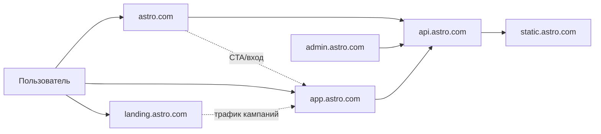
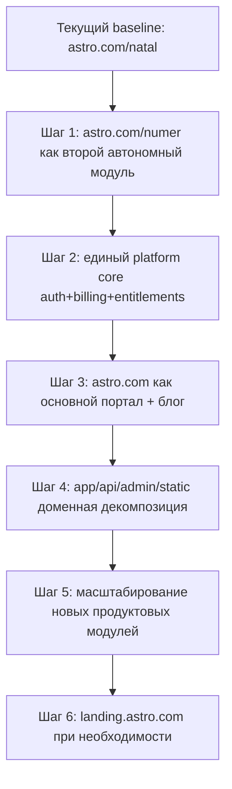

# Архитектура URL-пространства проекта «Астро»

Версия: `v0.2`  
Статус: `Working Draft / Обновлено с учетом этапа natal -> numer -> platform`

---

## 1) Цель документа

Зафиксировать целевую архитектуру URL-пространства экосистемы `astro.com` как:
- единую модель масштабирования продукта;
- основу для SEO, SSO и безопасного разделения зон доступа;
- поэтапный план внедрения без болезненных миграций доменов в будущем.

Документ описывает архитектуру доменов и маршрутов. Технологический стек намеренно не фиксируется.

Контекст текущего этапа:
- фактически в продакшн-логике реализован первый продуктовый модуль `astro.com/natal`;
- следующий самостоятельный модуль — `astro.com/numer`;
- параллельно формируется основной портал `astro.com` (контент + блог + витрина);
- объединение продуктов выполняется через единые platform-сервисы (auth, billing, entitlements).

---

## 2) Каноническая структура доменов

| URL | Назначение | Тип зоны |
|---|---|---|
| `astro.com` | Маркетинговый сайт + блог | Публичная контентная зона |
| `app.astro.com` | Единое пользовательское приложение (кабинет + сервисы) | Продуктовая зона |
| `api.astro.com` | Единая backend-точка входа | API-шлюз / сервисный периметр |
| `admin.astro.com` | Управление пользователями, контентом, тарифами | Закрытая административная зона |
| `static.astro.com` | Статические и сгенерированные файлы | CDN/файловая зона |
| `landing.astro.com` | Изолированные кампании (опционально) | Экспериментальная промо-зона |

---

## 2.1) Референсная ссылочная архитектура (как делать новые модули)

Этот раздел — короткий стандарт, который можно применять сразу для новых направлений.

Канонический формат:

```text
astro.com/<product>              # публичная витрина продукта + вход в сценарий
astro.com/<product>/...          # SEO-страницы и сценарии внутри продукта
admin.astro.com/<product>/...    # админ-раздел этого продукта
api.astro.com/v1/<product>/...   # API-контур продукта
```

Примеры для текущих модулей:

```text
astro.com/natal                  # проект "Натальная карта"
astro.com/natal/report
astro.com/natal/compatibility

astro.com/numer                  # проект "Нумерология"
astro.com/numer/matrix
astro.com/numer/biorhythm

admin.astro.com/natal            # админка натала
admin.astro.com/numer            # админка нумерологии
admin.astro.com/users
admin.astro.com/billing

api.astro.com/v1/natal/*
api.astro.com/v1/numer/*
```

Правило масштабирования "и т.д.":
- каждый новый продукт добавляется как отдельный префикс `astro.com/<new-product>`;
- админ-функции этого продукта живут в `admin.astro.com/<new-product>`;
- API-эндпоинты этого продукта живут в `api.astro.com/v1/<new-product>/...`;
- общие сущности платформы (профиль, платежи, доступы) не дублируются по продуктам и остаются общими.
- платформенные контуры (админка, БД, billing, отправка отчетов, storage/S3) переиспользуются всеми продуктами;
- отличие модулей фиксируется в доменных endpoint'ах, типах запросов и pipeline-логике (например, `natal` и `taro` могут иметь разные workflow при общей платформе).

Рекомендуемый шаблон для любого нового модуля:

```text
astro.com/<new-product>
astro.com/<new-product>/about
astro.com/<new-product>/pricing
astro.com/<new-product>/report/:id

admin.astro.com/<new-product>/dashboard
admin.astro.com/<new-product>/config
admin.astro.com/<new-product>/orders

api.astro.com/v1/<new-product>/calculate
api.astro.com/v1/<new-product>/reports
api.astro.com/v1/<new-product>/history
```

---

## 3) Глобальная схема взаимодействия



Смысл разбиения:
- `astro.com` отвечает за привлечение и прогрев;
- `app.astro.com` концентрирует продуктовую логику и удержание;
- `admin.astro.com` изолирует операционный контур;
- `api.astro.com` унифицирует контракты между всеми фронтами;
- `static.astro.com` снимает нагрузку с продуктовых узлов.

---

## 4) URL-архитектура по зонам

### 4.1 `astro.com` — маркетинговое ядро и блог

Цели:
- SEO-трафик и контентная дистрибуция;
- конвертация в регистрацию/покупку в `app.astro.com`.

Базовая структура:

```text
astro.com/
├── /                     # Главная с УТП, квизом и CTA в app
├── /blog/                # SEO-контент
│   ├── /category/natal/
│   ├── /category/numerology/
│   └── /article-slug/
├── /about/
├── /pricing/             # Витрина тарифов, переход в app/signup
└── /contacts/
```

Принцип: блог предпочтительно в подпапке `/blog`, чтобы усиливать доменный SEO-вес `astro.com`.

---

### 4.2 `app.astro.com` — единое пользовательское приложение

Цели:
- единый вход в продукты и подписки;
- независимый релизный цикл от маркетинговой части;
- единая auth/session-модель.

Базовая структура:

```text
app.astro.com/
├── /
├── /login
├── /signup
├── /natal/
│   ├── /new
│   ├── /report/:id
│   └── /history
├── /numerology/
├── /profile/
└── /wallet/
```

---

### 4.3 `api.astro.com` — единый API-контур

Цели:
- один публичный вход для всех клиентских приложений;
- централизованные auth/rate-limit/observability-политики;
- масштабирование через внутренние сервисы.

Базовая структура:

```text
api.astro.com/
├── /v1/
│   ├── /auth/
│   ├── /users/
│   ├── /natal/
│   ├── /numerology/
│   ├── /billing/
│   └── /reports/
└── /health
```

Возможная проксирующая модель:
- `api.astro.com/natal/* -> natal-service`;
- `api.astro.com/numerology/* -> numerology-service`.

Важно:
- `v1` в URL — версия API-контракта (совместимость клиентов), а не версия внутренней бизнес-логики;
- изменение LLM-промптов и pipeline внутри модуля не требует `v2`, пока сохраняется обратная совместимость контракта;
- `v2` требуется только при несовместимых изменениях формата/семантики API.

---

### 4.4 `admin.astro.com` — закрытая админ-зона

Цели:
- изоляция административных рисков;
- отдельные политики доступа (MFA, VPN, allowlist);
- управляемость контента и монетизации.

Базовая структура:

```text
admin.astro.com/
├── /dashboard
├── /users/
├── /natal/config/
├── /blog/posts/
└── /billing/plans/
```

---

### 4.5 `static.astro.com` — файловое хранилище/CDN

Назначение:
- аватары, иллюстрации, PDF-отчеты и иные тяжелые ресурсы;
- кэшируемая доставка контента отдельным доменом.

Примеры:
- `static.astro.com/avatars/user123.jpg`
- `static.astro.com/reports/order_456.pdf`

---

### 4.6 `landing.astro.com` — изолированные кампании (опционально)

Назначение:
- быстрые промо-кампании;
- риск-изоляция рекламного трафика от основного домена.

Пример:
- `landing.astro.com/black-friday`

---

## 5) Логика SSO между `astro.com` и `app.astro.com`

Ключевой принцип: единая сессия на доменном уровне второго уровня.

Cookie-политика:

```text
Set-Cookie: session_id=XYZ; Domain=.astro.com; Path=/; HttpOnly; Secure; SameSite=Lax
```

Поток авторизации:
1. Пользователь логинится на `app.astro.com/login` (или унифицированной форме входа).
2. `api.astro.com` выставляет cookie с `Domain=.astro.com`.
3. Любой фронтенд (`astro.com`, `app.astro.com`) делает `GET /v1/users/me`.
4. При валидной сессии состояние пользователя синхронизируется без повторного логина.

CORS-требование:
- whitelist минимум: `https://astro.com`, `https://app.astro.com`, `https://admin.astro.com`.

---

## 6) Продуктовые пакеты и модель монетизации (URL-уровень витрины)

Тарифные уровни:
- Бесплатно;
- Средний (`$7/мес`);
- Премиум (`$15/мес`).

Продуктовый каталог (пример целевой матрицы):
- Нумерология, Квадрат Пифагора, Матрица Судьбы, Биоритмы;
- Лунный календарь, Таро, Руны, И-Цзин, Быстрые оракулы;
- Натальная карта, Транзиты, Прогрессии, Лал Китаб;
- `KP / BodyGraph` как отдельные премиум-модули;
- Хиромантия: от опросника к AI-фото-анализу (будущий этап).

Архитектурный принцип:
- витрина тарифов на `astro.com/pricing`;
- покупка/апгрейд внутри `app.astro.com` (единый billing-контур).

---

## 6.1) Взаимодействие блога и продуктовых модулей

Роль блога в архитектуре:
- блог в `astro.com/blog` — верх воронки (SEO + прогрев);
- продуктовые модули (`/natal`, `/numer`, далее новые) — зона конверсии и удержания;
- портал `astro.com` связывает контентные сценарии и продуктовые сценарии в единой сессии.

Базовый поток пользователя:
1. Пользователь приходит в статью блога по информационному запросу.
2. Внутри статьи размещается контекстный CTA на конкретный модуль (`/natal` или `/numer`).
3. При переходе в модуль сохраняется source/utm контекст.
4. Модуль проверяет сессию и entitlements:
   - если доступ есть — пользователь попадает в рабочий сценарий;
   - если доступа нет — открывается paywall/апгрейд через единый billing-контур.
5. После оплаты/апгрейда права применяются централизованно и доступны в соответствующих модулях без повторной покупки.

Принципы интеграции:
- контентные страницы не дублируют бизнес-логику продуктов;
- продукты не реализуют отдельные версии auth/billing;
- проверка доступов выполняется через единый entitlement-слой;
- переходы из блога в продукт должны быть бесшовными (без потери состояния пользователя).

Минимальный набор аналитики для связки "контент -> продукт":
- `blog_article_view`;
- `blog_cta_click`;
- `product_entry_from_blog`;
- `signup_or_login_started`;
- `purchase_or_upgrade_completed`;
- `first_value_event` (первое успешное действие в модуле после перехода из блога).

KPI связки:
- CTR из статей в продуктовые сценарии;
- конверсия "блог -> регистрация";
- конверсия "блог -> покупка/апгрейд";
- время до первого ценностного действия в модуле;
- доля повторных входов в продукты после контентного касания.

---

## 7) Пошаговая реализация (roadmap)



Порядок внедрения:
1. Зафиксировать `astro.com/natal` как стабильный baseline и завершить контракт интеграции с platform-слоем.
2. Запустить `astro.com/numer` как второй автономный модуль, совместимый с теми же platform-контрактами.
3. Внедрить единый platform core:
   - unified auth/session;
   - единый billing-контур;
   - модель entitlements (доступы/лимиты по продуктам).
4. Параллельно развивать `astro.com` как основной портал и запустить блог в `astro.com/blog`.
5. Довести доменную декомпозицию до канонической (`app`, `api`, `admin`, `static`) без ломки пользовательских сценариев.
6. Подключать новые продукты как отдельные модули по стандартному шаблону интеграции.
7. Добавлять кампанийные лендинги на `landing.astro.com` при маркетинговой необходимости.

Принцип этапа:
- сначала независимые продуктовые вертикали (`natal`, `numer`);
- затем объединение на уровне платформы (auth/billing/entitlements);
- затем масштабирование экосистемы под новые модули.

---

## 8) Нефункциональные требования (архитектурный минимум)

- Доменная политика безопасности: HSTS, TLS only, secure cookies.
- Изоляция контуров: публичный/продуктовый/админский/статический.
- Версионирование API: обязательный префикс `/v1` (с подготовкой к `/v2`).
- Наблюдаемость: health/readiness, trace-id между фронтами и API.
- Управление редиректами: кампанийные и промо URL не должны ломать SEO-каноникал.

---

## 9) ADR-вопросы, которые нужно зафиксировать перед финализацией

1. Канонический блог: строго `/blog` на `astro.com` или допустим fallback `blog.astro.com`?
2. Единая форма логина: где canonical entrypoint (`astro.com/login` или только `app.astro.com/login`)?
3. Стратегия API: чистый REST или гибрид с GraphQL BFF для части UI?
4. Уровень изоляции админки: достаточно MFA+RBAC или обязателен VPN/IP allowlist?
5. Путь к файлам отчетов: публичные signed URLs или выдача только через backend proxy?
6. `landing.astro.com`: всегда отдельный хост или часть кампаний оставлять в `astro.com/campaign/*`?

---

## 10) Definition of Done для архитектуры URL-пространства

Документ считается принятым, когда:
- утвержден канонический список доменов и их зон ответственности;
- утверждена cookie/CORS/SSO-модель;
- зафиксированы обязательные security-политики для `admin` и `api`;
- утвержден порядок rollout и KPI каждого этапа;
- сформированы ADR-решения по вопросам раздела 9;
- зафиксирован стандарт подключения новых продуктовых модулей к platform core.
